# Mazaq (مذاق) — website + mobile app

Monorepo for the Mazaq specialty-coffee brand: a Next.js ordering website and an Expo (iOS + Android) app sharing one design system, menu dataset and cart logic. English and Arabic (RTL) throughout.

**Live website:** https://mazaq-coffee.web.app  ·  Arabic: https://mazaq-coffee.web.app/ar

## Screenshots

### Website

| Home | Menu |
|---|---|
| 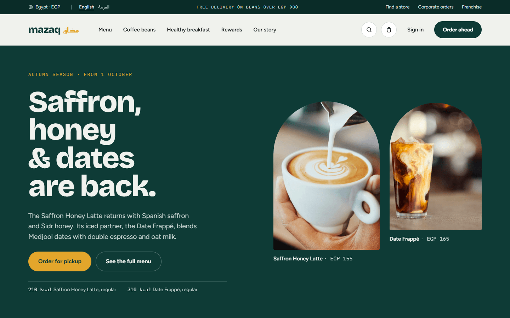 | 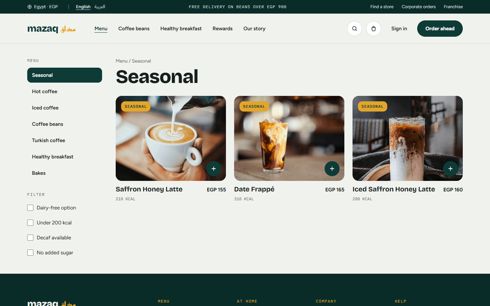 |
| **Drink customization** | **Store finder** |
| 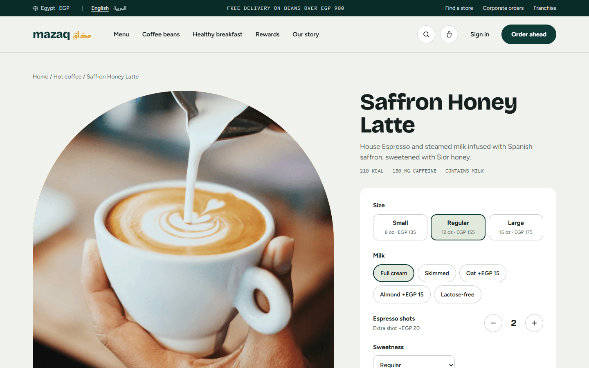 | 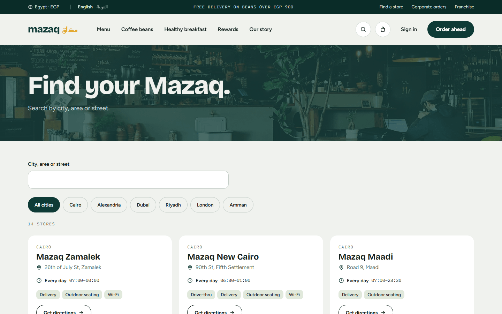 |
| **Rewards** | **Arabic (RTL)** |
| 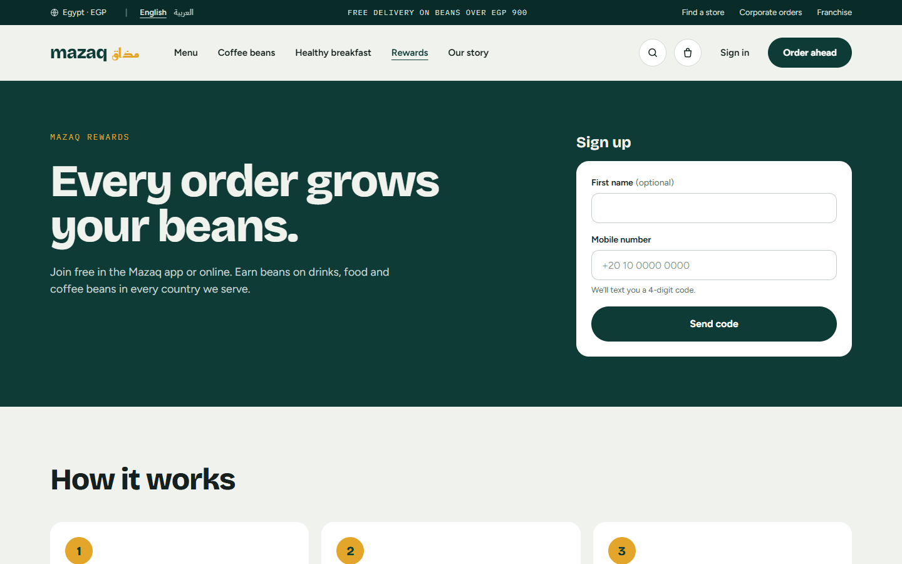 | 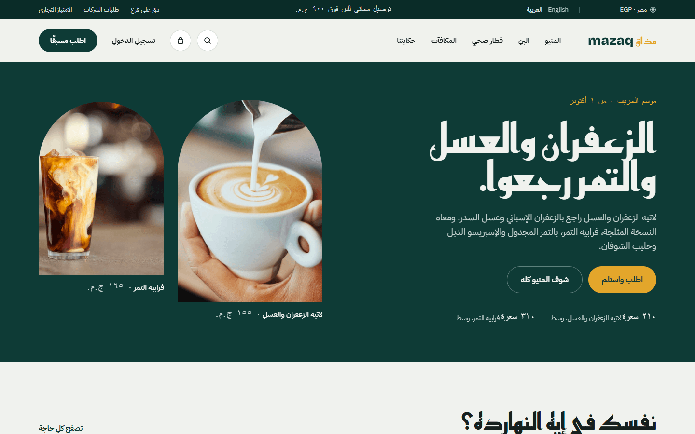 |

<p>
  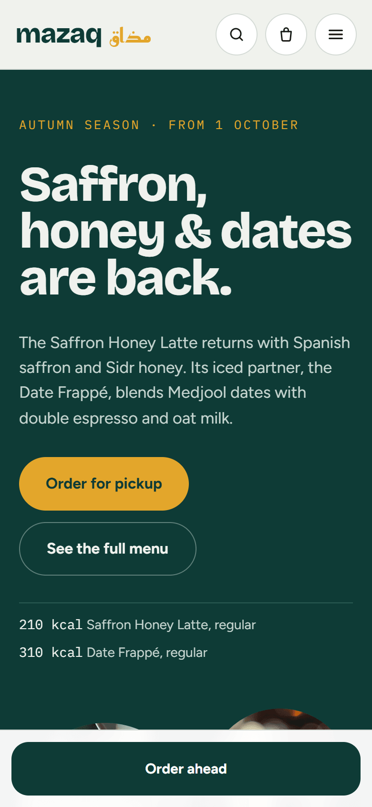
  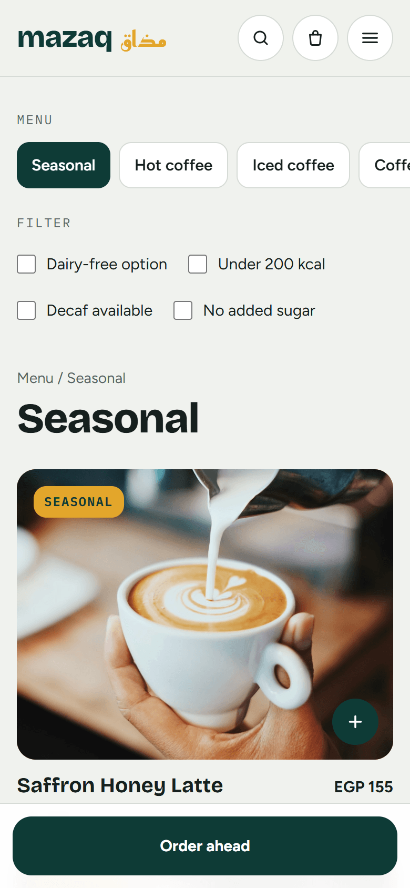
  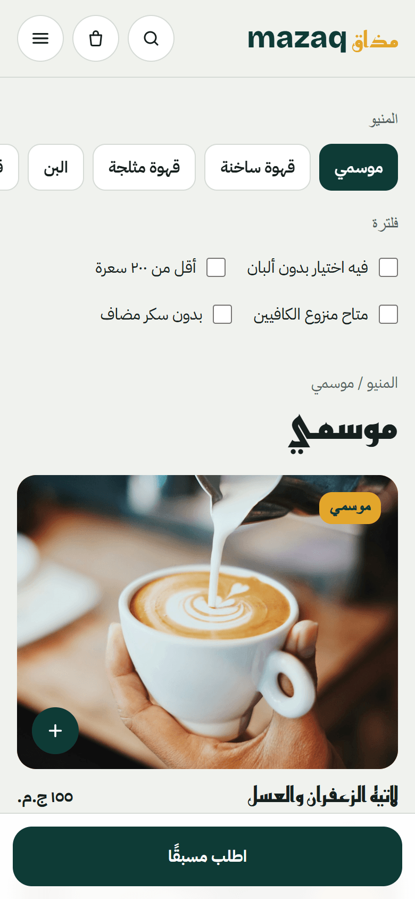
</p>

### Mobile app (iOS / Android)

<p>
  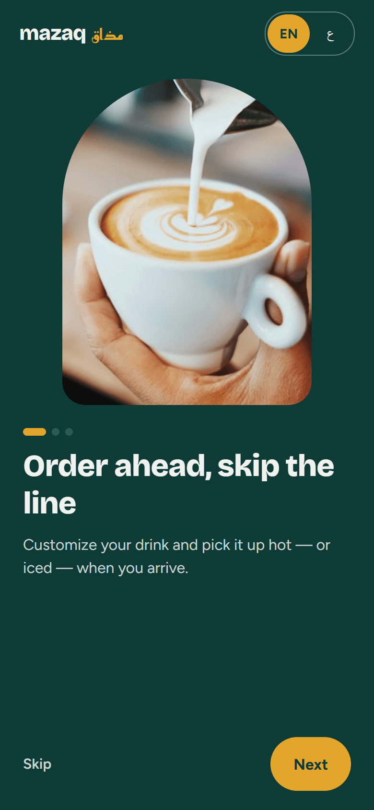
  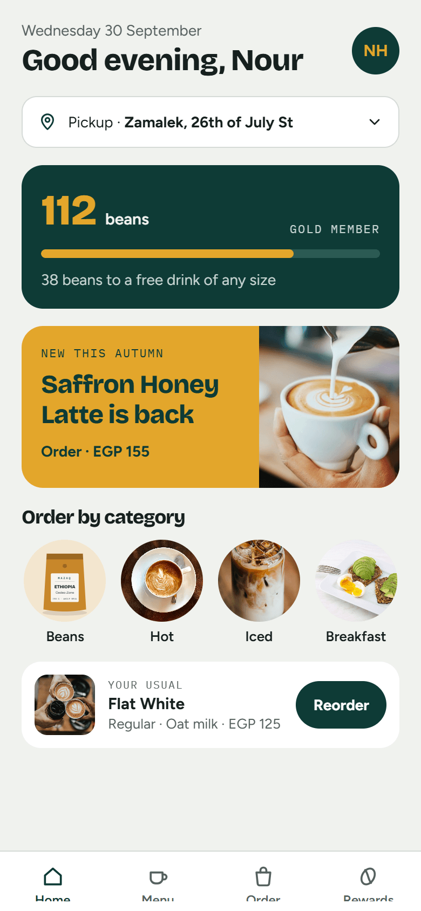
  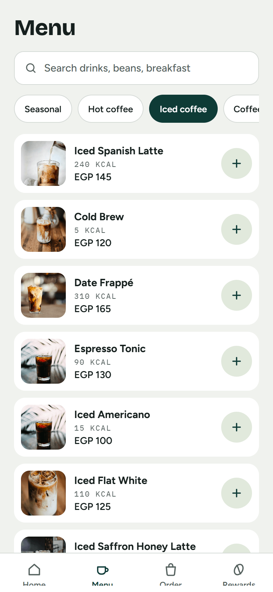
  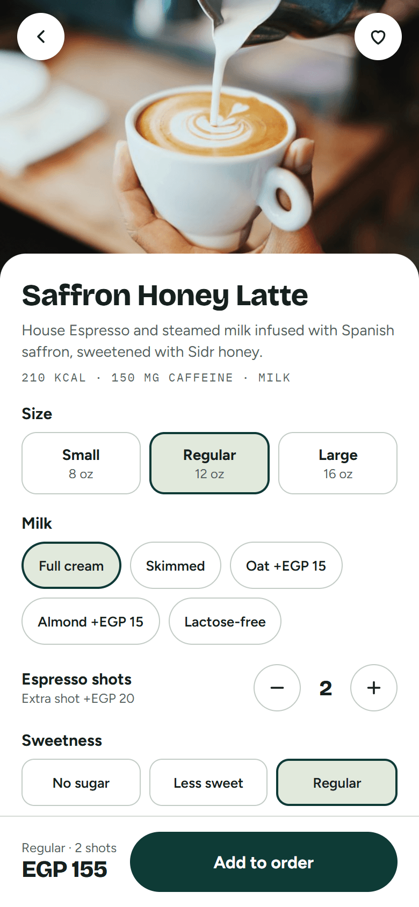
  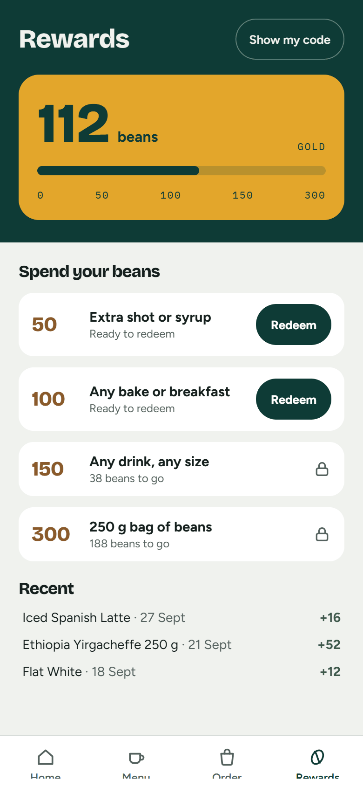
  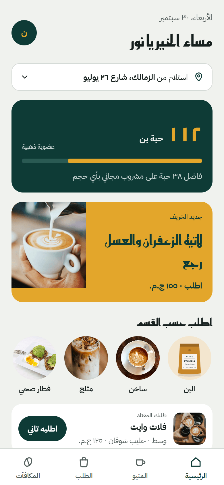
</p>

## Project structure

```
apps/
  web/        Next.js 16 (App Router), Tailwind v4, next-intl — /en and /ar
  mobile/     Expo SDK 57 + expo-router, i18next, RTL via I18nManager
packages/
  tokens/     colours, type, spacing, radii → TS + Tailwind theme.css + RN theme
  menu/       typed menu (every item), markets & prices, pricing helpers, image catalogue
  cart/       Zustand cart store shared by web and mobile (totals, VAT, beans, pickup slots)
  i18n/       en.json / ar.json message files shared by both apps
  api/        MazaqApi interface + mock backend (stores, orders, rewards, forms, OTP)
scripts/
  fetch-images.mjs   `pnpm images:fetch` — verify, download and credit Unsplash photos
```

## Requirements

- Node 20+ and pnpm 10 (`npm i -g pnpm`)
- For the app: the **Expo Go** app on a phone, or an Android emulator / iOS simulator

## Run

```bash
pnpm install

# Website → http://localhost:3000 (redirects to /en; Arabic at /ar)
pnpm dev

# Mobile app → scan the QR code with Expo Go
pnpm --filter mobile start
```

Other commands:

```bash
pnpm test           # Vitest for all packages
pnpm typecheck      # TypeScript, every workspace
pnpm lint           # ESLint (web)
pnpm build          # production build
pnpm test:e2e       # Playwright smoke test (home → menu → customize → checkout), desktop + 390px
pnpm images:fetch   # re-download photos (add --force to overwrite) and regenerate CREDITS.md
pnpm deploy:web     # static export of the website + Firebase Hosting deploy
```

The Playwright config uses the locally installed Chrome (`channel: 'chrome'`). Set `PW_CHANNEL=` and run `npx playwright install chromium` to use Playwright's own browser instead.

## Swapping in a real backend

Everything the apps fetch goes through `packages/api` (`api.getStores`, `api.placeOrder`, `api.getRewards`, …). Implement the `MazaqApi` interface (for example with Supabase) and call `setApi(yourImpl)` at app start-up.

## Placeholders the client must confirm before launch

| What | Where |
|---|---|
| **Prices in AED, SAR, JOD and GBP** — generated from EGP with a placeholder index | `packages/menu/src/markets.ts` |
| **Nutrition values** (kcal, protein, caffeine) — working values; confirm with a nutritionist | `packages/menu/src/items.ts` |
| **Store addresses, coordinates, phones and opening hours** — illustrative | `packages/api/src/stores.ts` |
| **Photo choices and 9 unconfirmed photographer credits** (marked ⚠️) | `CREDITS.md`, `packages/menu/src/images.json` |
| **Halloumi wrap photo** (illustration for now) and a **green shakshuka** photo | `images.json` |
| **Bakes** — three placeholder items (the brief named the category without items) | `items.ts` (`placeholder: true`) |
| Hotline number, email, legal copy (privacy, terms) | `packages/i18n/src/*.json` |
| VAT rates for non-Egypt markets and free-delivery thresholds | `markets.ts` |
| App Store / Play Store links (currently `#`) | `apps/web/src/app/[locale]/page.tsx` |

See `DECISIONS.md` for choices made where the brief was silent.
